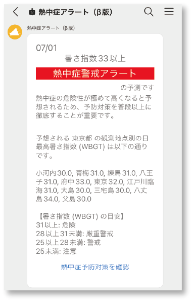
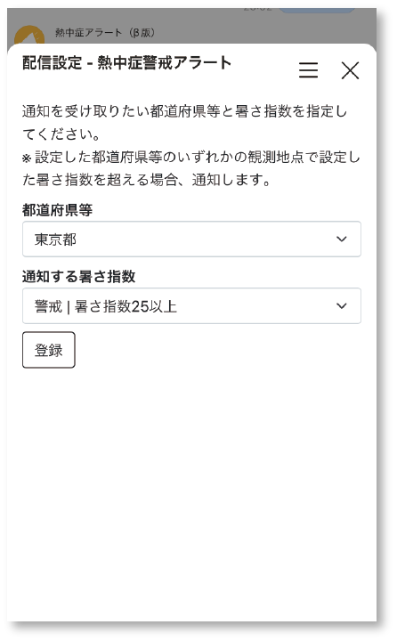
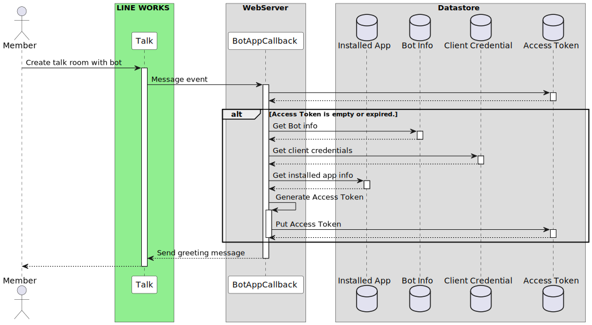
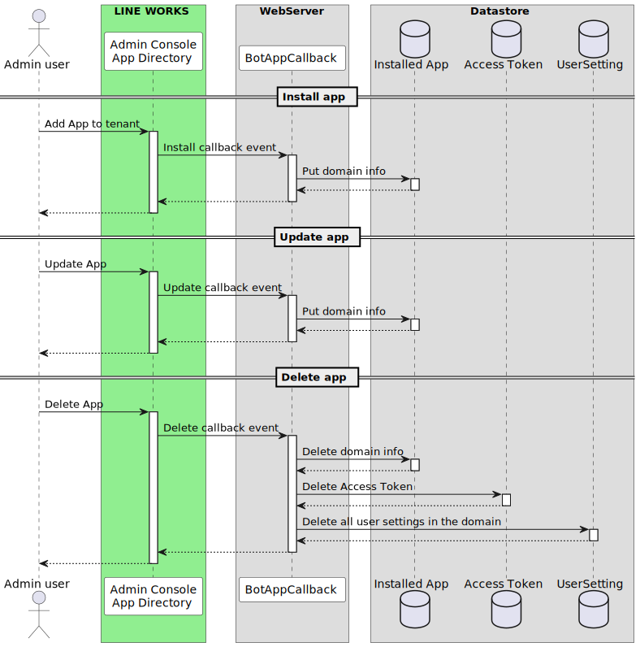
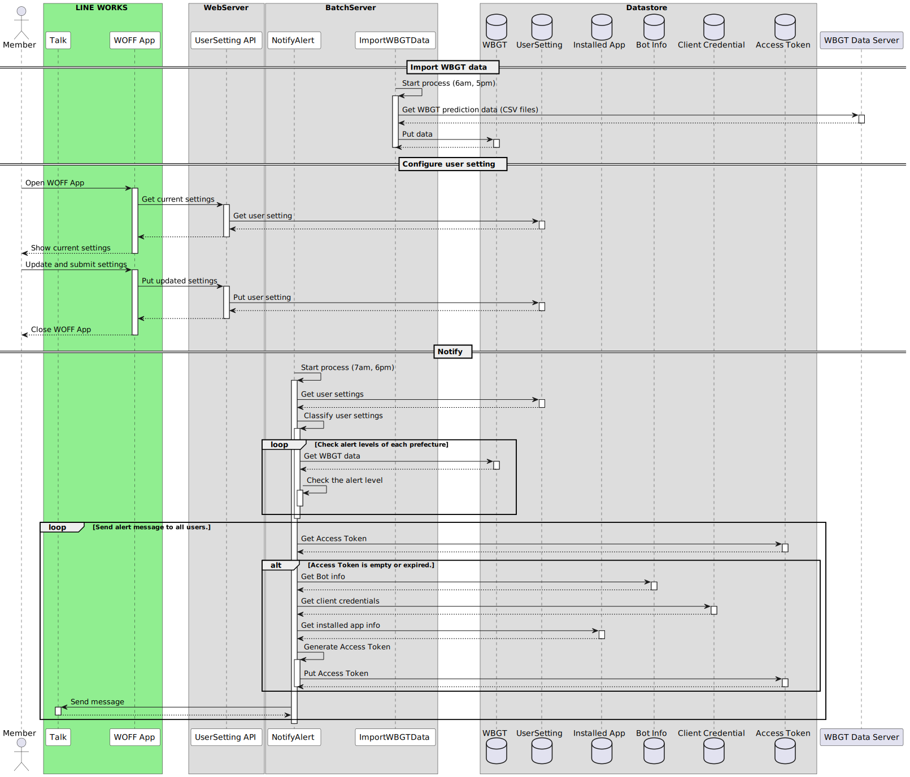

# LINE WORKS 熱中症アラート Bot

## 概要
このリポジトリは、LINE WORKSのBotとして動作する「熱中症アラートBot」のアプリケーションソースコードです。
暑さ指数 (WBGT) の予測データを元に、熱中症への警戒度を定期通知します。




## 機能
- 熱中症への警戒度や暑さ指数の情報の配信。
- 通知の対象エリアや通知条件の設定。

## 使用している LINE WORKS Developers の機能
- [Bot](https://developers.worksmobile.com/jp/docs/bot)
- [WOFF](https://developers.worksmobile.com/jp/docs/woff-guide)

## 参照データ
環境省が運営する「暑さ指数（WBGT）予測値等 電子情報提供サービス」が提供する予測値情報を利用しています。
https://www.wbgt.env.go.jp/data_service.php

## 機能
### トークへの配信
- LINE WORKSのBotと通して、ユーザーに「暑さ指数 (WBGT)」と「警戒レベル」を配信。
- 配信日時は、毎日2回 前日18時と当日7時。
    - 参考: 気象庁は、1日2回、前日17時と当日5時に熱中症警戒アラートの発表する。https://www.wbgt.env.go.jp/alert_lp.php

### ユーザー個別の配信設定
- 「配信設定」画面をWOFFアプリとして用意し、Botとのトークルーム上からアクセス。
- ユーザー単位に配信設定が可能。
- 「対象エリア (都道府県等)」 と「配信の閾値 (通知する暑さ指数)」を設定
    - 対象エリアの区分は、気象庁の熱中症アラートの区分を参考 https://www.jma.go.jp/bosai/information/heat.html

### 対応言語
日本語のみ

----

## Development
### High-level Architecture
High-level Architecture & database tables


### Flow
#### Start using
利用開始時



#### (WORKS platform App) Install / Update / Uninstall


#### User setting & Notify
配信設定と配信実行



### Infrastructure (AWS version)
本リポジトリは、AWS上に展開を想定したアプリケーションコードとしている。

AWSのServerless servicesを利用した構成。


### Backend apps
AWS Lambda + SQS を使った構成。

[`backend/`](./backend) directory参照。

- Language: Python
- Frameworks:
    - [Powertools for AWS Lambda (Python)](https://docs.powertools.aws.dev/lambda/python/latest/)

### Frontend apps
Single page applicationとして作成。

[`frontend/`](./frontend) directory参照。

----

## Deploy (for AWS)
### Prepare workspace by Docker container
Deployのための環境はDockerコンテナで用意。

```sh
docker compose up -d --build
```

Login

```sh
docker compose exec workspace bash
```

### Add Bot and WOFF
BotとWOFFを追加し、Bot ID と WOFF ID を取得する。

- Bot guide: https://developers.worksmobile.com/jp/docs/bot#step-one-add-to-tenant
- WOFF guide: https://developers.worksmobile.com/jp/docs/woff-guide#create-woff-app

### Deploy Backend apps
[Serverless Framework](https://www.serverless.com/) でデプロイする。

[serverless.yaml](./backend/serverless.yml) にてAWS LambdaやSQS、DynamoDBテーブルが定義されている。

```sh
sh deploy_backend_aws.sh <bot id> <author> <stage> <aws profile>
```

### Deploy Frontend apps
[Webpack](https://webpack.js.org/) でbuildし、その後 S3 バケットへアップロードする。

```sh
sh deploy_frontend_aws.sh <stage> <backet_path> <aws profile>
```

その後、S3のBacket policyやCloudFrontなどの設定を行い、パブリックにアクセスできるように環境を整備する。

### Confiture Bot and WOFF
デプロイ後、Frontend appのURLをWOFFアプリに登録する。

また、トークルームからアクセスできるよう、WOFF URLへリンクするボタンをもつ固定メニューをBotに追加する。

API: https://developers.worksmobile.com/jp/docs/bot-persistentmenu-create

そして、LINE WORKS APIのアクセストークン取得のための以下の情報を、DBへ格納する。

- Domain ID
- Client ID
- Client Secret
- Service Account
- Private Key

Scopeは `bot` が必要。

参考: https://developers.worksmobile.com/jp/docs/auth

----

## License
[Unlicense license](LICENSE)

## Contribute
1. Fork this repository
2. Create a feature branch
3. Commit your changes
4. Rebase your local changes against the master branch
5. Create a new Pull Request

