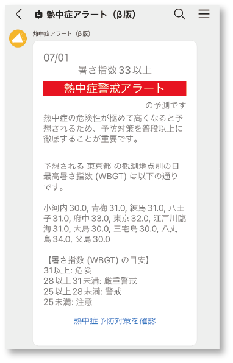
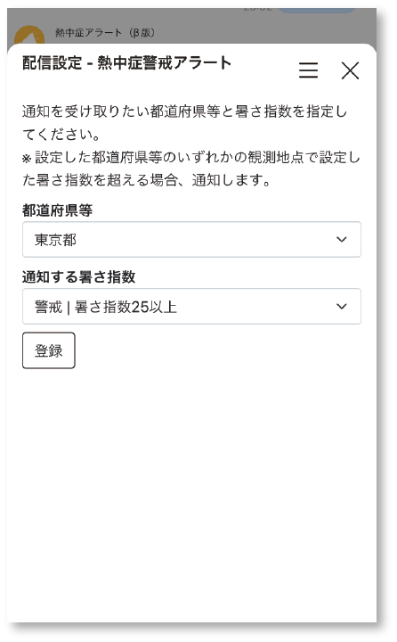
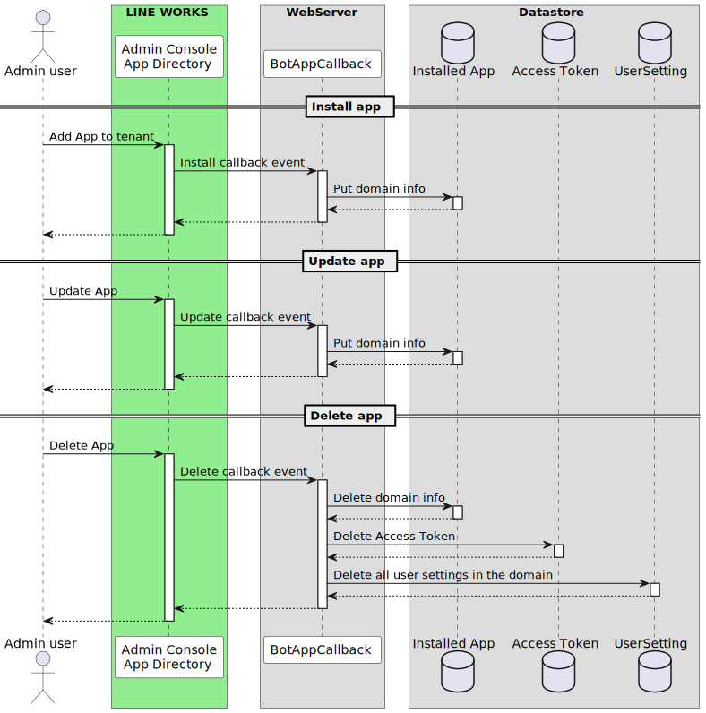

# WORKS Heat Stroke Alert Bot

## Japanese README
[日本語バージョン](README.ja.md)

## Overview
This repository is the application source code of "Heat Stroke alert bot" that works as a WORKS bot.
Based on the prediction data of the heat index (WBGT), it regularly notifies the degree of alertness to heatstroke.




## Features
- Distribute information on heat stroke alertness and heat index.
- Set notification target areas and notification conditions.

## Functions of LINE WORKS Developers used
- [Bot](https://developers.worksmobile.com/jp/docs/bot)
- [WOFF](https://developers.worksmobile.com/jp/docs/woff-guide)

## reference data
We use the predicted value information provided by the "Electronic Information Service for Heat Index (WBGT) Predicted Values" operated by the Ministry of the Environment.
https://www.wbgt.env.go.jp/data_service.php

## Spec
### Notify to Talk
- Distribute "heat index (WBGT)" and "warning level" to users through LINE WORKS bot.
- Delivery date and time is twice a day, 18:00 the day before and 7:00 on the day.
    - Reference: The Japan Meteorological Agency issues heatstroke warnings twice a day, at 17:00 the day before and at 5:00 the day of the event. https://www.wbgt.env.go.jp/alert_lp.php

### User-specific delivery settings
- Prepare the "Distribution Settings" screen as a WOFF app and access it from the chat room with the bot.
- Distribution settings can be set for each user.
- Set "target area (prefecture, etc.)" and "distribution threshold (notification heat index)"
    - Refer to the Japan Meteorological Agency's heatstroke alert classifications for target areas https://www.jma.go.jp/bosai/information/heat.html

### Supported language
only Japanese

----

## Development
### High-level Architecture
High-level Architecture & database tables


### Flow
#### Start using


#### (WORKS platform App) Install / Update / Uninstall


#### User setting & Notify


### Infrastructure (AWS version)
This repository is an application code that is deployed on AWS.

Using AWS Serverless services.


### Backend apps
AWS Lambda + SQS

See [`backend/`](./backend) directory。

- Language: Python
- Frameworks:
    - [Powertools for AWS Lambda (Python)](https://docs.powertools.aws.dev/lambda/python/latest/)

### Frontend apps
Single page application

See [`frontend/`](./frontend) directory。

----

## Deploy (for AWS)
### Prepare workspace by Docker container

```sh
docker compose up -d --build
```

Login

```sh
docker compose exec workspace bash
```

### Add Bot and WOFF
Add Bot and WOFF, then get Bot ID and WOFF ID.

- Bot guide: https://developers.worksmobile.com/jp/docs/bot#step-one-add-to-tenant
- WOFF guide: https://developers.worksmobile.com/jp/docs/woff-guide#create-woff-app

### Deploy Backend apps
Deploy by [Serverless Framework](https://www.serverless.com/)

See [`serverless.yml`](./backend/serverless.yml)

```sh
sh deploy_backend_aws.sh <bot id> <author> <stage> <aws profile>
```

### Deploy Frontend apps
Build by [Webpack](https://webpack.js.org/) and upload to S3 bucket.

```sh
export WOFF_ID=your-WOFFID
export USER_SET_API_URL=your-user-setting-api-url
sh deploy_frontend_aws.sh <stage> <backet_path> <aws profile>
```

After that, set the S3 Backet policy and CloudFront, etc., and prepare the environment so that it can be accessed publicly.

### Confiture Bot and WOFF
After deployment, register the Frontend app URL to the WOFF app.

Also add a static menu to the bot with a button that links to the WOFF URL so that it can be accessed from the chat room.

API: https://developers.worksmobile.com/jp/docs/bot-persistentmenu-create

Then, store the following information to the DB for obtaining access token for LINE WORKS API.

- Domain ID
- Client ID
- Client Secret
- Service Account
- Private Key

Scope `bot`

Refer to https://developers.worksmobile.com/jp/docs/auth

----

## Question / Issue / Requests
Please post questions and discussions about the sample code to [Github Discussions](https://github.com/lineworks/works-api-usecase-heatstroke-alert-bot/discussions).

## License
[Unlicense license](LICENSE)
